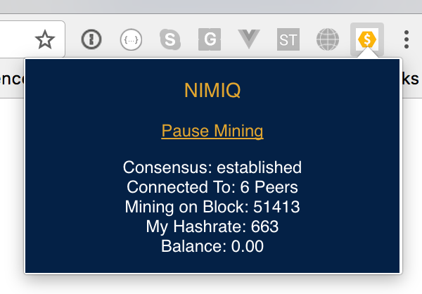

# Nimiq Miner (Betanet)

> A Chrome Extension for mining Nimiq in the background

Built with love using [Vue.js](https://vuejs.org) and [Nimiq](https://nimiq.com) by [@ralafranchi](https://twitter.com/ralafranchi)



## Build Setup

``` bash
# install dependencies
npm install

# serve with hot reload at localhost:8080
npm run dev

# build for production with minification
npm run build

# build for production and view the bundle analyzer report
npm run build --report
```

# Installing Chrome Extension

After a build has been run you can open your extensions ([chrome://extensions](chrome://extensions)), flip on developer mode and load unpacked extension to point to the dist folder.  When the mainnet is released we plan to release the extension in the chrome webstore.

# Vue-cli

Template initialized using [vue-cli](http://vuejs-templates.github.io/webpack/)
